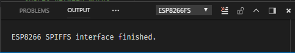

# Visual Studio Code extension for ESP8266 File System (SPIFFS)


Welcome to the Visual Studio extension for the **ESP8266 File System SPIFFS**.

This extension provides the same functionality for VSCode as the [Arduino ESP8266 filesystem uploader](https://github.com/esp8266/arduino-esp8266fs-plugin) does for the [Arduino IDE](https://www.arduino.cc/en/Main/Software): it packages and uploads a BLOB to an ESP8266 allowing it to use a portion of it's Flash Memory as a Storage Device with [SPIFFS](http://esp8266.github.io/Arduino/versions/2.0.0-rc2/doc/filesystem.html) (**SPI** **F**lash **F**ile **S**ystem).

Whereas the **Arduino IDE** version adds a menu item to the IDE (*Tools/ESP8266 Sketch Data Updoad*), VSCode provides no such mechanism.  Instead, this extension implements a VSCode command (`ESP8266FS: Upload SPIFFS`) to perform the same task.

This extension also adds commands to unpack, list, and "visualize" the contents of a **SPIFFS** image.

While this extension really doesn't need the **Arduino IDE** installed - it only needs the ESP8266 package and tools - it's best to have it installed anyway.  This extension is meant to be a companion extension for the [Arduino for Visual Studio Code](https://github.com/Microsoft/vscode-arduino) plugin, which relies on the **Arduino IDE** to compile and upload code through their toolchain.

## Features

* Works with or without the **Arduino for Visual Studio Code** plugin installed.  Just needs [**mkspiffs**](https://github.com/igrr/mkspiffs), [**esptool**](https://github.com/espressif/esptool), and [**espota.py**](https://github.com/esp8266/Arduino/blob/master/tools/espota.py) (if using OTA updating).
* Implements VSCode commands to:
  * pack & upload,
  * unpack,
  * list,
  * and visualize a **SPIFFS** image.
* Uses settings from:
  * **.vscode/arduino.json**,
  * **settings.json**
  * or **...arduino.../preferences.txt**.
* Overrides available for all toolchain settings in the **settings.json** file.

> Tip: Add the "esp866fs.uploadSpiffs" command to your **gulp/webpack** toolchain to turn your ESP8266 into a "one-button" dev cycle.

## Requirements

The [ESP8266 core for Arduino](https://github.com/esp8266/Arduino) needs to be installed on your computer.  This is best done through the [Arduino IDE](https://www.arduino.cc/en/Main/Software)'s Board Manager (*Tools/Board/Board Manager...*) or via the [Arduino for Visual Studio Code](https://github.com/Microsoft/vscode-arduino)'s `Arduino: Board Manager` command.

If you manually install the ESP8266 package, you can still use this extension by setting all the path location overrides.

## Installation

Open VS Code and press `F1` or `Ctrl+Shift+P` to open command palette, select **Install Extension** and type `vscode-esp8266fs`.

Or launch VS Code Quick Open (`Ctrl+P`), paste the following command, and press enter.

```bash
ext install vscode-esp8266fs
```

You can also install directly from the Marketplace within Visual Studio Code: search for `ESP8266FS`.

## Getting Started

After installing this extension, you need to:

1. Create a new VSCode Project via the **Arduino for Visual Studio Code** extension (Command: `Arduino: Initialize`) or a new sketch with the **Arduino IDE** (`File/New`).

1. Add the URL **[http://arduino.esp8266.com/stable/package_esp8266com_index.json](http://arduino.esp8266.com/stable/package_esp8266com_index.json)** to the Additional Board URL settings.

1. Install the **ESP8266** board from the Board Manager: (VSCode: `Arduino: Board Manager`, or IDE: `Tools/Board/Board Manager...`).

1. Select an **ESP8266** board as the target development board.

1. Select the desired **SPIFFS** program/storage split (Arduino: *Tools/Flash Size...*, VSCode: *arduino.changeBoardType*).

1. Create and populate a directory with the files to be uploaded to the target **ESP8266 SPIFFS** partition - **`i.e. that will replace the current ESP8266 SPIFFS contents!`**

1. Set the `esp8266fs.dataFiles` setting to point the base directory of the files that will be uploaded.  If the default directory **./data** is used, this setting can be ignored.

1. Optionally - Set the `esp8266fs.spiffsImage` setting to a filename that **mkspiffs** will create.

1. Done - you can now run the commands provided by this extension on the `esp8266fs.dataFiles` and `esp8266fs.spiffsImage`.

> Note: Maximum length  of a file name in **SPIFFS** is 32 characters.  Subdirectories are "simulated" in that a file name really contains the "/" of the file's folder.  I.e. a file stored at "/abc/def/ghi.txt" has a name with 16 characters.  Files are packed relative to the `path` setting and not of the base OS.

---

## Commands

All of the commands send their spew to the ESP8266FS OUTPUT window.  The amount of spew is dictated by the `logLevel`.  Setting it to "debug" will send more spew back to the hosting debugger and has no effect on using the extension.



| Name                                    | Command id                  | Description                                  |
| --------------------------------------- |:--------------------------- |:-------------------------------------------- |
| `ESP8266FS: Upload SPIFFS`              | *esp8266fs.uploadSpiffs*    | Create and Upload a SPIFFS image.            |
| `ESP8266FS: Pack SPIFFS`                | *esp8266fs.packSpiffs*      | Creates the SPIFFS image.      |
| `ESP8266FS: Unpack SPIFFS`              | *esp8266fs.unpackSpiffs*    | Unpacks the contents of a SPIFFS image.      |
| `ESP8266FS: List SPIFFS`                | *esp8266fs.listSpiffs*      | List the contents of a SPIFFS image.         |
| `ESP8266FS: Visualize SPIFFS`           | *esp8266fs.visualizeSpiffs* | "Visualizes" the contents of a SPIFFS image. |

### Pack & Upload

`ESP8266FS: Upload SPIFFS` - this command packs all of the files in the `esp8266fs.dataFiles` subdirectory using the **mkspiffs** tool into the `esp8266fs.spiffsImage` file.  The `esp8266fs.spiffsImage` will then be sent to the **ESP8266** using the **esptool** or **espota.py** tool (depending on the output port).

### Pack

`ESP8266FS: Pack SPIFFS` - this command packs all of the files in the `esp8266fs.dataFiles` subdirectory using the **mkspiffs** tool into the `esp8266fs.spiffsImage` file.

### Unpack

`ESP8266FS: Unpack SPIFFS` - this command will take the `esp8266fs.spiffsImage` and unpack all the contents into the `esp8266fs.dataFiles` folder using the **mkspiffs** tool.

### List

`ESP8266FS: List SPIFFS` - this command will list the contents  of the `esp8266fs.spiffsImage` using the **mkspiffs** tool.

### Visualize

`ESP8266FS: Visualize SPIFFS` - this command will "visualize" the contents  of the `esp8266fs.spiffsImage` using the **mkspiffs** tool.

## Options

The following Visual Studio Code settings are available for the **ESP8266FS** extension. These can be set in the global user preferences `Ctrl+,` or workspace settings (.vscode/settings.json). The later overrides the former. None of these settings are necessary as all have default values, or are deduced from the environment.

## *`.vscode/settings.json`*

```json
{
    ...

        //--- Arduino for Visual Studio Code setting

    "arduino.path": "C:/Program Files (x86)/Arduino",

        //--- Python path - needed for espOTA.py

    "python.pythonPath": "C:/Python34/python.exe",

        //--- ESP8266FS for Visual Studio Code settings

    "esp8266fs.dataFiles": "./data",
    "esp8266fs.preferencesPath" : "C:/Users/X/AppData/Local/Arduino15",
    "esp8266fs.spiffsImage": "./temp/spiffs.image.bin",
    "esp8266fs.logLevel": "normal",

    "esp8266fs.mkspiffs.executable": "C:/Users/X/AppData/Local/Arduino15/packages/esp8266/tools/mkspiffs/0.2.0/mkspiffs.exe",
    "esp8266fs.mkspiffs.debugLevel": "0",
    "esp8266fs.mkspiffs.allFiles": true,

    "esp8266fs.esptool.executable": "C:/Users/X/AppData/Local/Arduino15/packages/esp8266/tools/esptool/0.4.12/esptool.exe",
    "esp8266fs.esptool.verbosity": "vvv",

    "esp8266fs.espota.py": "C:/Users/X/AppData/Local/Arduino15/packages/esp8266/hardware/esp8266/2.4.0/espota.py",
    "esp8266fs.espota.esp.port": 8266,
    "esp8266fs.espota.host.ip": "0.0.0.0",
    "esp8266fs.espota.host.port": 12345,
    "esp8266fs.espota.debug": true,

    ...
}
```

### vscode

* `arduino.path` - (*defined by the **Arduino for Visual Studio Code** plugin).   From their README: Path to Arduino, you can use a custom version of Arduino by modifying this setting to include the full path. Example: "`C:\\Program Files\\Arduino`" for Windows, "`/Applications`" for Mac, "`/home/$user/Downloads/arduino-1.8.1`" for Linux.

> Note: this parameter is **mandatory** for Linux as the `arduino` shell command can be placed anywhere and is not installed through the OS.  Do not use the **Arduino IDE** installable through any Ubuntu repositories (they're too old) - install the latest version found at [www.arduino.cc](https://www.arduino.cc/en/Main/Software).

* `python.pythonPath` - Path to the **python** executable; as defined by the VSCode Python Environment. Can be set via the `Python: Select Interpreter` command.
If not specified, then "**python**" will be used.  Only needed if using OTA (espota.py).

### esp8266fs

* `esp8266fs.dataFiles` - Location of the base directory of the files to be uploaded to the ESP8266's SPIFFS.  File names will be generated relative to this path.  Default is "**./data**".

* `esp8266fs.preferencesPath` - Location of the **Arduino IDE**'s "preferences.txt" file and installed libraries.  This value does not need to be set, but exists to override the default location.

* `esp8266fs.spiffsImage` - Name of the packed **SPIFFS** image.  Default is "**./spiffs.image**".

* `esp8266fs.logLevel` - Changes the amount of spew produced.  Set to either `normal`, `verbose`, `silent`, or `debug`. Default is **normal**.

### mkspiffs

* `esp8266fs.mkspiffs.executable` - Path to **mkspiffs** executable.  If not specified, then ESP8266FS will attempt to locate it through the Arduino settings.

* `esp8266fs.mkspiffs.debugLevel` - Debug spew level for **mkspiffs**.  Default is **0**.

* `esp8266fs.mkspiffs.allFiles` - Tells **mkspiffs** to include ignored files (*.DS_Store* and *.git* directories).  Default is **false**.

### esptool

* `esp8266fs.esptool.executable` - Path to **esptool** executable.  If not specified, then ESP8266FS will attempt to locate it through the Arduino settings.

* `esp8266fs.esptool.verbosity` - **esptool** verbosity.  Add more **v**'s to be more verbose.  Default is no **v**'s.

### espota

* `esp8266fs.espota.py` - Path to the **espota** python script.  If not specified, then ESP8266FS will attempt to locate it through the Arduino settings.

* `esp8266fs.espota.esp.port` - IP port for the target **ESP8266**.  Default is **8266**.
* `esp8266fs.espota.host.ip` - IP address for the host.  Default is "**0.0.0.0**".
* `esp8266fs.espota.host.port` - IP port for the host.  Default is a random port: 10000-60000.

* `esp8266fs.espota.auth` - Authentication password for the **espota** python script.  Default is not set.

* `esp8266fs.espota.debug` - Enables debug output from the **espota** python script.  Default is **false**.

## *`.vscode/arduino.json`*

The following settings are per sketch settings (*defined by the **Arduino for Visual Studio Code** plugin).  You can find them in `.vscode/arduino.json` in the workspace.  The `.vscode/arduino.json` file has "per sketch" settings.

```json
{
    "port": "COM6",
    "board": "esp8266:esp8266:generic",
    "configuration": "...FlashSize=4M3M,...ResetMethod=ck,..."
}
```

* `port` - Name of the serial port connected to the device. Can be set by the `Arduino: Select Serial Port` command.  Alternatively, if you specify an IP address (x.x.x.x), then the `espota.py` script will be executed to communicate with the ESP8266 (**OTA** = **O**ver **T**he **A**ir).

* `board` - Current selected Arduino board alias. Can be set by the `Arduino: Change Board Type` command. Also, you can find the board list there.
* `configuration` - (*Undocumented*) A comma-delimited string of the configuration settings selected for all board "menu" items.  **ESP8266FS** relies on two key/value pairs in the string: `FlashSize` and `ResetMethod`.

Alternatively, if the `.vscode/arduino.json` file doesn't exist, or a particular setting is not defined, then the settings in the **Arduino IDE**'s `preferences.txt` file will be used instead.  This file is generated by the **Arduino IDE** and is set globally for ALL sketches.

## *`preferences.txt`*

```ini
board=generic
target_package=esp8266
target_platform=esp8266

serial.port=COM6

custom_FlashSize=generic_4M3M
custom_ResetMethod=generic_ck
```

---

## Support

You can find the full list of issues at [Issue Tracker](http://github.com/kash4kev/vscode-esp8266fs/issues), and you can [submit a bug or feature suggestion](http://github.com/kash4kev/vscode-esp8266fs/issues/new).

## Development

Installing Prerequisites:

* [Git](https://git-scm.com/)
* [Node.js](https://nodejs.org/) (>= 6.5.0)
* [Npm](https://www.npmjs.com/) (>= 3.10.3)

To *run and develop*, do the following:

1. `git clone https://github.com/kash4kev/vscode-esp8266fs`.
1. `cd vscode-esp8266fs`.
1. Open in Visual Studio Code (`code .`).
1. Install the dependent NPM packages (`Tasks/Run Task.../Install NPM packages`).
1. Press `F5` to debug.

---

## Change Log

See the [Change log](https://github.com/kash4kev/vscode-esp8266fs/blob/master/CHANGELOG.md) for the details of changes for each version.

## Known Issues

None - that I know of.  Please [submit a bug or feature suggestion](http://github.com/kash4kev/vscode-esp8266fs/issues/new) if you find something amiss.

## Release Notes

## [1.0.1] 2018-4-7

* Fixed errata and ran **markdownlint** on all .md files.
* Fixed all missing overrides.  Expanded OTA overrides.
* Added `esp8266.packSpiffs` command.
* Made showErrorMessage modal.
* Added "#region" tags to source code.
* Refactored "upload" to minimize external tool requirements.
* Removed `esp8266fs.python`, defering to `python.pythonPath`.

## [1.0.0] 2018-2-13

* Fixed errata and expanded documentation.
* Located espota.py correctly.
* Changed `esp8266fs.uploadData` -> `esp8266fs.uploadSpiffs`.
* Added `esp8266fs.unpackSpiffs`, `esp8266fs.listSpiffs`, and *esp8266fs.visualizeSpiffs`.
* Added a variety of settings.json values to allow full control of the mkspiffs *rocess.
* Fixed various bugs and cleaned up code heirarchy.
* Updated Github infrastructure.
* Tested on Windows, OSX, and Linux (Ubuntu).

## [0.9.0] - 2018-02-11

* Initial release - out for review.

## License

This extension is licensed under the [MIT License](https://github.com/Microsoft/vscode-esp8266fs/blob/master/LICENSE.txt).